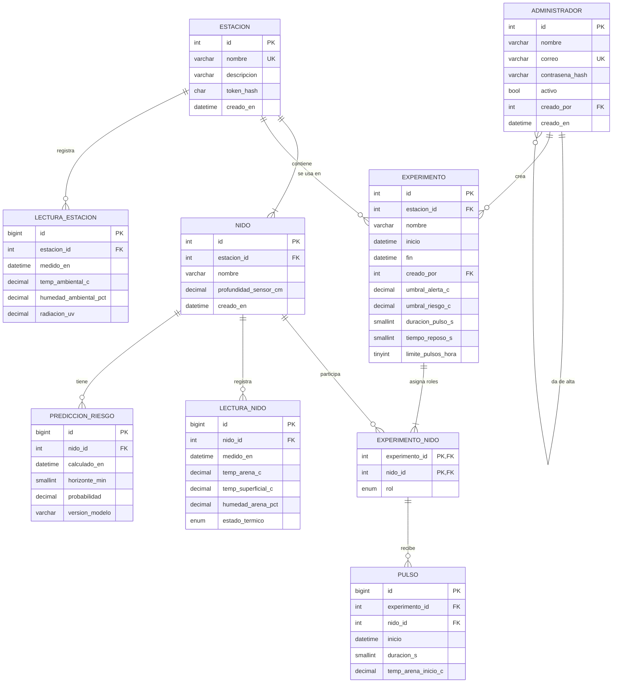

# Modelo de datos de NIDOVA

Entregable de la Etapa 1 de Gestores de BD: tablas, diccionario de datos, normalización y diagrama E-R. El script ejecutable está en [`db/schema.sql`](../../db/schema.sql) (MySQL 8). Los nombres siguen el glosario de [`CONTEXT.md`](../../CONTEXT.md).

## Diagrama E-R

**Para MySQL Workbench (herramienta CASE, Etapa 2):** *File → Import → Reverse Engineer MySQL Create Script…* y seleccionar `db/schema.sql`. Workbench genera el diagrama E-R editable.

## Tablas

| Tabla | Qué guarda |
|---|---|
| `administrador` | Personas con sesión que gestionan el sistema. |
| `estacion` | Un conjunto de nidos con sus sensores ambientales compartidos. |
| `nido` | Cada modelo físico de nido de una estación. |
| `experimento` | Periodo de prueba con su configuración fija. |
| `experimento_nido` | Rol (control o tratado) de cada nido en cada experimento. |
| `lectura_nido` | Mediciones de arena de un nido cada 30 s. |
| `lectura_estacion` | Mediciones ambientales de una estación cada 30 s (temperatura, humedad del aire y UV). |
| `pulso` | Cada activación de la microaspersión. |
| `prediccion_riesgo` | Resultados del modelo de IA. |

El **Visitante** no tiene tabla porque no tiene cuenta.

## Diccionario de datos

Abreviaturas: **PK** llave primaria, **FK** llave foránea, **UK** valor único, **AI** autoincremento.

### administrador

| Campo | Tipo | Nulo | Clave | Descripción |
|---|---|---|---|---|
| id | INT UNSIGNED | No | PK, AI | Identificador del administrador. |
| nombre | VARCHAR(100) | No | | Nombre completo. |
| correo | VARCHAR(150) | No | UK | Correo con el que inicia sesión. |
| contrasena_hash | VARCHAR(255) | No | | Contraseña cifrada con bcrypt; nunca en texto plano. |
| activo | BOOLEAN | No | | FALSE impide iniciar sesión sin borrar su historial. Por defecto TRUE. |
| creado_por | INT UNSIGNED | Sí | FK → administrador | Administrador que lo dio de alta. NULL solo en el primero. |
| creado_en | DATETIME | No | | Fecha de alta. |

### estacion

| Campo | Tipo | Nulo | Clave | Descripción |
|---|---|---|---|---|
| id | INT UNSIGNED | No | PK, AI | Identificador de la estación. |
| nombre | VARCHAR(100) | No | UK | Nombre visible, por ejemplo "Estación laboratorio". |
| descripcion | VARCHAR(255) | Sí | | Ubicación o notas. |
| token_hash | CHAR(64) | No | | SHA-256 del token con el que el ESP32 se identifica al enviar datos. |
| creado_en | DATETIME | No | | Fecha de alta. |

### nido

| Campo | Tipo | Nulo | Clave | Descripción |
|---|---|---|---|---|
| id | INT UNSIGNED | No | PK, AI | Identificador del nido. |
| estacion_id | INT UNSIGNED | No | FK → estacion | Estación a la que pertenece. |
| nombre | VARCHAR(50) | No | UK (con estacion_id) | Nombre dentro de la estación, por ejemplo "Nido A". |
| profundidad_sensor_cm | DECIMAL(4,1) | No | | Profundidad del sensor de temperatura de arena (la de los huevos). Mayor que 0. |
| creado_en | DATETIME | No | | Fecha de alta. |

### experimento

| Campo | Tipo | Nulo | Clave | Descripción |
|---|---|---|---|---|
| id | INT UNSIGNED | No | PK, AI | Identificador del experimento. |
| estacion_id | INT UNSIGNED | No | FK → estacion | Estación donde se realiza. |
| nombre | VARCHAR(100) | No | | Nombre, por ejemplo "Pulsos de 10 s". |
| descripcion | VARCHAR(500) | Sí | | Hipótesis o notas. |
| inicio | DATETIME | No | | Inicio del experimento. |
| fin | DATETIME | Sí | | Fin. NULL mientras está activo. Debe ser posterior a `inicio`. |
| creado_por | INT UNSIGNED | No | FK → administrador | Quién lo creó. |
| umbral_alerta_c | DECIMAL(4,1) | No | | Temperatura de arena a partir de la cual el estado es Alerta. Por defecto 32.0. |
| umbral_riesgo_c | DECIMAL(4,1) | No | | Temperatura de arena a partir de la cual el estado es Riesgo. Por defecto 34.0. Debe ser mayor que `umbral_alerta_c`. |
| duracion_pulso_s | SMALLINT UNSIGNED | No | | Duración de cada pulso en segundos. Por defecto 10. |
| tiempo_reposo_s | SMALLINT UNSIGNED | No | | Espera mínima entre pulsos en segundos. Por defecto 300. |
| limite_pulsos_hora | TINYINT UNSIGNED | No | | Máximo de pulsos por hora. Por defecto 6. |
| estacion_activa_id | INT UNSIGNED | Sí | UK | Columna calculada automáticamente: vale `estacion_id` mientras `fin` es NULL. Su índice único garantiza un solo experimento activo por estación. |

### experimento_nido

| Campo | Tipo | Nulo | Clave | Descripción |
|---|---|---|---|---|
| experimento_id | INT UNSIGNED | No | PK, FK → experimento | Experimento. |
| nido_id | INT UNSIGNED | No | PK, FK → nido | Nido que participa. |
| rol | ENUM('control','tratado') | No | | Rol del nido en ese experimento. |

### lectura_nido

| Campo | Tipo | Nulo | Clave | Descripción |
|---|---|---|---|---|
| id | BIGINT UNSIGNED | No | PK, AI | Identificador de la lectura. |
| nido_id | INT UNSIGNED | No | FK → nido, UK (con medido_en) | Nido medido. |
| medido_en | DATETIME | No | UK (con nido_id) | Hora del ESP32 (NTP) en que se midió. |
| recibido_en | DATETIME | No | | Hora en que llegó al servidor. Puede ser posterior si venía del búfer. |
| temp_arena_c | DECIMAL(5,2) | Sí | | Temperatura de arena en °C. NULL si el sensor no respondió. |
| temp_superficial_c | DECIMAL(5,2) | Sí | | Temperatura superficial en °C. |
| humedad_arena_pct | DECIMAL(5,2) | Sí | | Humedad de arena en % (sensor calibrado). |
| estado_termico | ENUM('normal','alerta','riesgo','sin_datos') | No | | Estado térmico que calculó el ESP32 en ese momento. |

### lectura_estacion

| Campo | Tipo | Nulo | Clave | Descripción |
|---|---|---|---|---|
| id | BIGINT UNSIGNED | No | PK, AI | Identificador de la lectura. |
| estacion_id | INT UNSIGNED | No | FK → estacion, UK (con medido_en) | Estación medida. |
| medido_en | DATETIME | No | UK (con estacion_id) | Hora del ESP32. |
| recibido_en | DATETIME | No | | Hora de llegada al servidor. |
| temp_ambiental_c | DECIMAL(5,2) | Sí | | Temperatura ambiental en °C. |
| humedad_ambiental_pct | DECIMAL(5,2) | Sí | | Humedad relativa del aire en %. |
| radiacion_uv | DECIMAL(5,2) | Sí | | Índice UV. |

### pulso

| Campo | Tipo | Nulo | Clave | Descripción |
|---|---|---|---|---|
| id | BIGINT UNSIGNED | No | PK, AI | Identificador del pulso. |
| experimento_id | INT UNSIGNED | No | FK → experimento_nido | Experimento bajo cuya configuración ocurrió. |
| nido_id | INT UNSIGNED | No | FK → experimento_nido, UK (con inicio) | Nido tratado que recibió el pulso. |
| inicio | DATETIME | No | UK (con nido_id) | Hora del ESP32 en que empezó. |
| duracion_s | SMALLINT UNSIGNED | No | | Duración real en segundos. |
| temp_arena_inicio_c | DECIMAL(5,2) | No | | Temperatura de arena que disparó el pulso. |
| recibido_en | DATETIME | No | | Hora de llegada al servidor. |

### prediccion_riesgo

| Campo | Tipo | Nulo | Clave | Descripción |
|---|---|---|---|---|
| id | BIGINT UNSIGNED | No | PK, AI | Identificador de la predicción. |
| nido_id | INT UNSIGNED | No | FK → nido | Nido evaluado. |
| calculado_en | DATETIME | No | | Cuándo se calculó. |
| horizonte_min | SMALLINT UNSIGNED | No | | Minutos hacia el futuro que cubre la predicción (por ejemplo, 30). |
| probabilidad | DECIMAL(5,4) | No | | Probabilidad de entrar en Riesgo dentro del horizonte, de 0 a 1. |
| version_modelo | VARCHAR(30) | No | | Versión del modelo que la generó, para comparar reentrenamientos. |

## Normalización

**Primera forma normal (1FN).** Todos los campos son atómicos y no hay grupos repetidos. Las variables no se guardan como "lista de sensores" dentro de un campo. Las lecturas de nido y de estación están separadas, así que una estación con N nidos no necesita columnas `temp_nido1`, `temp_nido2`, etc.

**Segunda forma normal (2FN).** Todas las tablas con llave simple (`id`) la cumplen automáticamente. La única llave compuesta es `experimento_nido (experimento_id, nido_id)`, y su único atributo, `rol`, depende de la llave completa: el mismo nido tiene roles distintos en experimentos distintos.

**Tercera forma normal (3FN).** Ningún atributo depende de otro que no sea llave:

- La **configuración** vive en `experimento` y no en una tabla aparte, porque es 1:1 con el experimento y no cambia mientras está activo (ADR-0006). Cada valor depende solo del experimento.
- Las **variables ambientales** están en `lectura_estacion`, no repetidas en cada lectura de nido, porque dependen de la estación y no del nido.
- El **rol** no está en `nido`, porque depende del par experimento-nido.

**Decisiones que parecen redundantes pero son intencionales:**

1. **`lectura_nido.estado_termico`** podría calcularse con la temperatura y los umbrales, pero se guarda porque registra **lo que decidió el ESP32 en ese momento** (ADR-0001), un hecho histórico. Además, sin experimento activo no hay umbrales en la BD, y para `sin_datos` hace falta la regla de validación del ESP32.
2. **`pulso.experimento_id`** podría deducirse por fechas, pero el ESP32 lo envía como la configuración con la que operaba. La llave foránea compuesta hacia `experimento_nido` garantiza además que el nido realmente participaba en ese experimento.

## Reglas que garantiza la base de datos

| Regla del dominio | Cómo se garantiza |
|---|---|
| Máximo un experimento activo por estación | Índice único sobre la columna calculada `estacion_activa_id`. |
| Un pulso solo ocurre en un nido que participa en el experimento | Llave foránea compuesta `pulso → experimento_nido`. |
| Umbral de alerta menor que el de riesgo | `CHECK` en `experimento`. |
| El ESP32 puede reenviar su búfer sin duplicar datos | `UNIQUE (nido_id, medido_en)`, `UNIQUE (estacion_id, medido_en)` y `UNIQUE (nido_id, inicio)`. |

**Reglas que valida la aplicación, no la BD:** que el nido de un pulso tenga rol `tratado`, que la configuración no se edite mientras el experimento está activo, y que un experimento tenga exactamente un nido control y al menos uno tratado.
